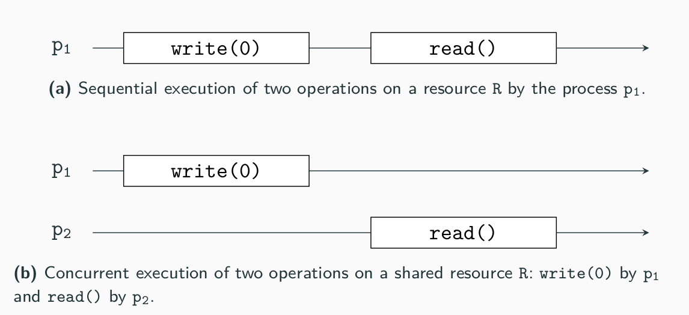

# Programming 2 - Exercise 9 : Parallel programming: threads and actors

In this exercise, you wil get familiar with the notions of parallelism and concurrency, and learn how to program using threads and actors. 

As in the every exercise you need to obtain the exercise files. Clone or fork the repository: `git clone https://github.com/ur-tcs/programming-2-ex-9.git` or download it by clicking on the green `<code>` button and select `download`.

__Your are allowed to copy/clone/fork this repository, but not to share solutions of the exercise in any public repository or web page.__

## Sequential, Parallel or Concurrent?  

Let us start by those three notions. For you, what is the difference between sequentiality, parallelism and concurrency? Can you find an example of something (a program, a real-life situation) that is parallel but not concurrent, and vice-versa? Can you draw a sequential, a parallel and a concurrent execution of a program (please specify the number of precesses, the shared ressources, etc)? Can a program have those tree characteristics at the same time? Which combination are allowed? 

<details>
  <summary>Solution</summary>

* In a sequential execution, every action is executed one after the other.
* Parallelism refers to the *behaviour of the program at running time*. In a parallel execution (with more than one process), the two processes are working at the exact same time. 
* Concurrency refers to the *conceptual* part of a program. In a concurrent execution (with more than one process accessing a shared ressource), different process are working on the same shared ressource.


 

* Sequential: (e.g.: a supermarket with only one cashier). Sequential activities depends from each other and are not executed simultaneously, sand so hey cannot e parallel or concurrent.
* Parallel but not concurrent: more than one process and no shared ressources (e.g.: a restaurant, each client eating its own food at the same time).
* Concurrent but not parallel: more than on process accessing the same ressource at different times (e.g.: cashiers incrementing the global sale amount). 
* Parallel and concurrent: more than one process accessing a shared ressource at the same time (e.g.: multiple reads in a database, human breathing in a classroom).


</details>

## Discover the Threads

Create a function that laucnh a thread an print its name
See that they not occurs in the right order

```Scala
// Scala code for thread creation by extending 
// the Thread class 
class MyThread extends Thread 
{ 
	override def run() 
	{ 
		// Displaying the thread that is running 
		println("Thread " + Thread.currentThread().getName() + 
										" is running.") 
	} 
} 

// Creating object 
object GFG 
{ 
	// Main method 
	def main(args: Array[String]) 
	{ 
		for (x <- 1 to 5) 
		{ 
			var th = new MyThread() 
						th.setName(x.toString()) 
							th.start() 
		} 
	} 
} 
```


## The Sum of Many

Now, you are going to make a function that compute the sum in two different way. First, let us define a sequential version of a sum up to $n$. 

```Scala
def sumSeq(n: Int) : Int = {
    n match
        case 0 => ???
        case _ => ???
}
```
This (not very smart function) add 1 $n$ times and returns the result. Complete the implementation in [threads/src/main/scala/sum/sum.scala](threads/src/main/scala/sum/sum.scala).

Now, let 

## Communication: Shared Memory VS. Message Passing

Let us see how threads can communicate. 


## Deadlocks and Rendez-Vous 

Launch thread, random action, then wait, decrement counter, and then resume 


## Concurrent Data Structures


## Example in which concurrency works better than sequential 
