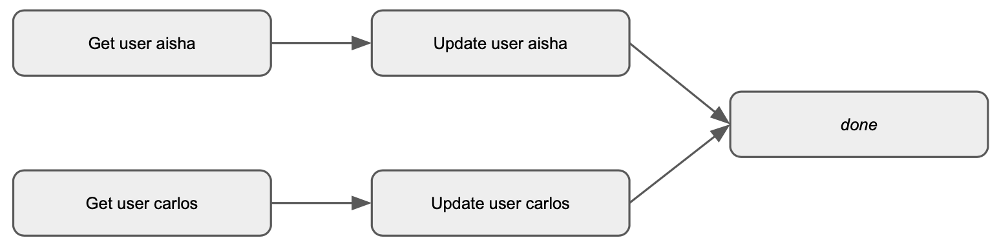
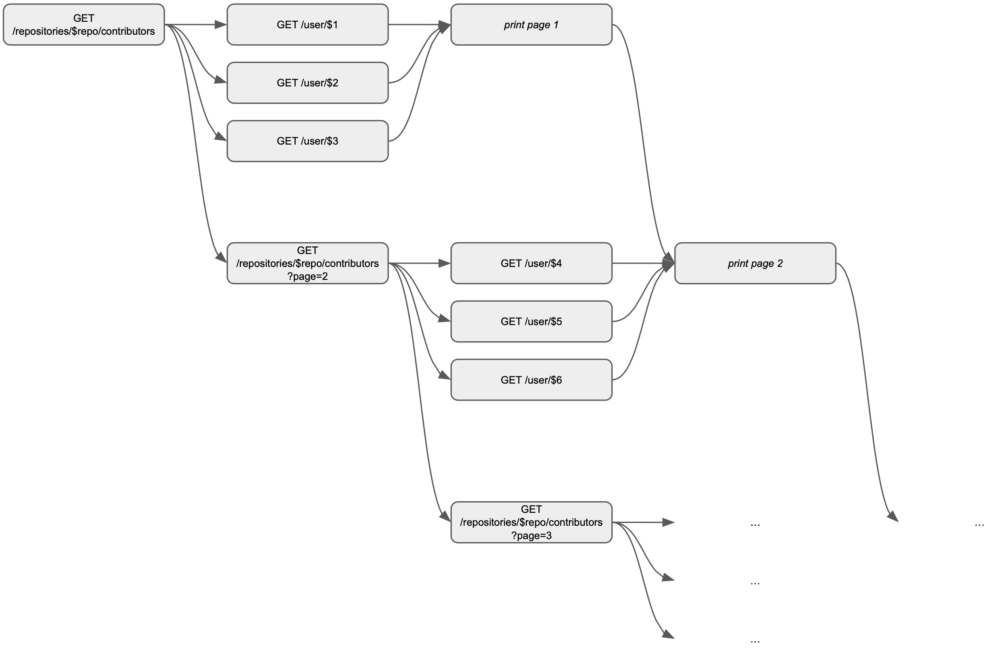

# Programming 2 - Exercise 9: Asynchronicity and Futures

Welcome to this exercise! We are going to work on the notion of *asynchronicity* and the use of `future`! 

Exercises marked with ⭐️ are the most important ones. Exercises marked with 🔥 are the most challenging ones. You do not need to complete all exercises to succeed in this class, and you do not need to do all exercises in the order they are written.

> [!NOTE]
> We strongly encourage you to solve the exercises orally or on paper first, in groups. After completing a first draft on paper, you may want to check your solutions on your computer.

## Making New Friends ⭐️

In this exercise, we will explore different styles of writing asynchronous in Scala: the “callback” style, the `Future` “monadic” style, and the `Future` “direct” style.

### The Social Network

Consider a directed graph where nodes are users of a social network, and edges represent friendship. In our model, friendship is a symmetric relation: if `a` is friends with `b`, then `b` is friends with `a`.

Your task is to write a function `makeFriends`. The function should take two users identifiers `user1Id: String` and `user2Id: String` as parameters, and update the list of friends of both users to add the other user *asynchronously*. This means that the function should return immediately, and the friend list should be updated eventually.

In order to achieve this, you will call asynchronous functions to get and update users.

The `User` class is defined as follows:
```Scala
case class User(id: String, friends: List[String])
```

In order to make two users friends, you will need to:

1. Get the first user from the database.
2. Add the second user to the first user’s friend list.
3. Update the first user in the database.
4. Get the second user from the database.
5. Add the first user to the second user’s friend list.
6. Update the second user in the database.
7. Notify the caller that the operation is complete.

> [!NOTE]
> To copy a `User` with a new list of friends, you can use its `copy` method:
>
> ```Scala
> user.copy(friends = ???)
> ```

### Sequential Execution

The first versions of the `makeFriends` we will study will perform the operations *sequentially*, one after the other:


In this representation, the arrows represent dependencies between operations: if there is an arrow from `a` to `b`, it means that `b` should only be executed after `a` has completed.

*Callback style*

The **“callback” style** was mostly used in the past, and is still used in some libraries. In this style, each asynchronous operation takes an additional callback function as a parameter, which is called with the desired result when the operation completes.

In this style, the `makeFriends` function takes an additional parameter `callback: () => Unit` which is called when the operation completes:

```Scala
def makeFriendsWithCallback(
    user1Id: String,
    user2Id: String,
    callback: () => Unit
): Unit =
  ???
```

Implement `makeFriendsWithCallback` by calling the following functions appropriately:

```Scala
def getUserWithCallback(id: String, callback: User => Unit): Unit
def updateUserWithCallback(user: User, callback: () => Unit): Unit
```

If you solve this exercise on a computer, you can check your solutions by running `makeFriendsMain` with the appropriate version identifier, here callbacks:

```Scala
sbt:futures> runMain makeFriendsMain callbacks
```

A correct implementation should print the following:

```Scala
running (fork) makeFriendsMain callbacks
Using callbacks
Waiting for callback to complete...
Get user aisha
Update user aisha
Get user carlos
Update user carlos
Aihsa and Carlos are now friends!
```

*Monadic style*

Let’s now use `Future`s, in the **“monadic” style**. In this style, each asynchronous operation returns a `Future` object, which represents the result of the operation. We can then use methods such as `map` and `flatMap` on the `Future` to transform and combine it with other `Future`s.

In this style, we never await on a `Future` directly, except at the very end of the program; your implementation must not call `Await.result`, `Await.ready` or `await`.

Complete the `makeFriendsMonadicFlatMap` function:
```Scala
def makeFriendsMonadicFlatMap(
    user1Id: String,
    user2Id: String
): Future[Unit] =
  ???
```

You can use the following functions to get and update users:

```Scala
def getUser(id: String): Future[User]
def updateUser(user: User): Future[Unit]
```

*Monadic style, with for-comprehensions*

As you have learned, combinations of `flatMap` and `map` can be written more concisely using for-comprehensions. Rewrite the previous solution using for-comprehensions:

```Scala
def makeFriendsMonadicFor(
    user1Id: String,
    user2Id: String
): Future[Unit] =
  ???
```

*Direct style*

Finally, let’s consider `Future`s in the **“direct” style**, which is a more recent style that is gaining popularity in many languages. In this style, we also use `Future`s, but we allow calling `await` from inside` Future`s whenever we want. This is the future of` Future`s in Scala, but is not yet ready for production use for the reasons explained in the lecture.

In this style, the `makeFriends` function also returns a `Future[Unit]`:

```Scala
def makeFriendsDirect(
    user1Id: String,
    user2Id: String
): Future[Unit] =
  ???
```

Implement it by calling the `getUser` and `updateUser` functions appropriately.

We also provide you with the following `await` extension method on Future that you can use to block until the result of a future is available:

```Scala
extension [T](self: Future[T])
  def await: T = Await.result(self, 3.seconds)
```

In the direct style, you can call `await`, as long you are inside a `Future`, so that you don’t block the main thread.

### Parallel Execution

Can we make the `makeFriends` function faster by executing some of the operations in parallel? Yes, we can!

Updating the two users can be done in parallel, since they are independent. Only the final operation, notifying the caller, depends on the two updates:



*Monadic style*

Implement `makeFriendsMonadicParallel`:

```Scala
def makeFriendsMonadicParallel(
    user1Id: String,
    user2Id: String
): Future[Unit] =
  ???
```

<details><summary>Hint</summary>

You can use a combination of `flatMap` and `map`, or `zip`, to combine two `Future`s into a single `Future` that completes when both `Future`s have completed.
</details>

*Direct style*

Implement `makeFriendsDirectParallel`:

```Scala
def makeFriendsDirectParallel(
    user1Id: String,
    user2Id: String
): Future[Unit] =
  ???
```

## Parallel Collections Implementation

Remember the parallel collections? How could you implement your own parallel collection using `Future`s?

In this exercise, you will implement `ParList`, a wrapper around a `List` that provides `map`, `flatMap` and `filter` methods that execute their argument functions in parallel.

```Scala
def map[U](f: T => U): ParList[U] =
  ???
```

```Scala
def flatMap[U](f: T => ParList[U]): ParList[U] =
  ???
```

```Scala
def filter(p: T => Boolean): ParList[T] =
  ???
```

<details><summary>Hint</summary>

You can use `Future.sequence` to combine a list of `Future`s into a single `Future` that completes when all the `Future`s have completed.
</details>


## Task Manager ⭐️

In this exercise, you will implement a simple command-line task manager. To start the REPL of the task manager, run `runMain tasksMain` in the sbt console.

### Adding Tasks

The first command to implement is `add`. It has the form of `add <time> <text>`, which runs a task that first waits for `<time>` seconds then prints out `<text>`. Right now the tasks run synchronously. The REPL is blocked while the task is running, and you can only enter a new command after the task has completed.

```Scala
sbt:futures> runMain tasksMain
[info] compiling 1 Scala source to /Users/linyxus/Workspace/course-material/exercises/futures/target/scala-3.3.1/classes ...
> add 10 hello
Started task
Finished task: hello
>
```

Now your task is to make the tasks run asynchronously, by modifying the following definition:

```Scala
case ADD_RE(duration, result) =>
  println(s"Started task")
  Thread.sleep(duration.toLong * 1000)
  println(s"Finished task: $result")
  loop()
```

> [!NOTE]
> Here, `ADD_RE` is a regex that matches the syntax of the `add` command.

Try numbering the tasks to distinguish them. The REPL should now work like the following:

```Scala
sbt:futures> runMain tasksMain
[info] running tasksMain 
> add 5 hello
> Started task #0
add 6 world
> Started task #1
Finished task #0: hello
Finished task #1: world
```

### Tasks with Dependencies

Implement another command `addafter <depid> <time> <text>`, which creates a task that waits for `<time>` seconds then prints out `<text>`, but starts running only after the task with id `<depid>` has completed.

```Scala
sbt:futures> runMain tasksMain
[info] running tasksMain 
> add 5 hello
> Started task #0
addafter 0 1 world
> Finished task #0: hello
Started task #1
Finished task #1: world
```

In this example, we start a task (numbered 0) that prints `hello` after 5 seconds, then start another task (numbered 1) which runs after the first one and prints world after 1 second. Task #1 starts only after #0 has completed.

Complete the following sketch.

```Scala
case ADD_AFTER_RE(after, duration, result) =>
  ???
```

## Utility Methods of Future ⭐️

Implement the following utility methods of `Future`:

```Scala
extension [T](self: Future[T])
  def map[U](f: T => U): Future[U] =
    ???
```

```Scala
extension [T](self: Future[T])
  def flatMap[U](f: T => Future[U]): Future[U] =
    ???
```

```Scala
extension [T](self: Future[T])
  def zip[U](other: Future[U]): Future[(T, U)] =
    ???
```

```Scala
def sequence[T](futures: List[Future[T]]): Future[List[T]] =
  ???
```

```Scala
def race[T](futures: List[Future[T]]): Future[T] =
  ???
```

You can play with your implementation by running `runMain futuresTest` in the sbt console.


## GitHub Contributors 🔥

In this exercise, you will implement a function that retrieves the list of contributors of a GitHub repository, and display their names and location:

```Scala
sbt:futures> runMain showContributorsMain nasa marsapi 3
[info] running (fork) showContributorsMain nasa marsapi 3
[info] Getting contributors of nasa/marsapi
[info] John from Lausanne, Switzerland
[info] Mary from somewhere
[info] James from Bangalore, India
[info] Patricia from Sydney
[info] Someone from Tokyo
```

The arguments to the `showContributorsMain` function are:

1. The name of a GitHub organization.
2. The name of a GitHub repository.
3. The number of contributors to get per page when querying the GitHub API (see below).

### GitHub API

In order to get the list of contributors of a GitHub repository, we will use the [GitHub REST API](https://docs.github.com/en/rest), in particular the [list contributors endpoint](https://docs.github.com/en/rest/repos/repos?apiVersion=2022-11-28#list-repository-contributors) and the [get user endpoint](https://docs.github.com/en/rest/users/users?apiVersion=2022-11-28#get-a-user):
1. The first enables us to get the list of contributors of a repository. For example, we can get the list of contributors of the lampepfl/gears repository by sending requesting [https://api.github.com/repos/lampepfl/gears/contributors](https://api.github.com/repos/lampepfl/gears/contributors).
2. The second enables us to get the details of a user. For example, we can get the details of the user odersky by sending requesting [https://api.github.com/users/odersky](https://api.github.com/repos/lampepfl/gears/contributors).

### Pagination

The GitHub API *paginates* the results of most endpoints that return sequences to avoid returning too much data at once.

You can control pagination using two URL parameters:

1. `per_page`: the number of results to return per page. This will be the `pageSize` parameter of the `showContributorsMain` and `showContributors` functions.
2. `page`: the page number to return.

Try it with the `lampepfl/gears` repository!

* [https://api.github.com/repos/lampepfl/gears/contributors?per_page=2](https://api.github.com/repos/lampepfl/gears/contributors?per_page=2)
* [https://api.github.com/repos/lampepfl/gears/contributors?per_page=2&page=2](https://api.github.com/repos/lampepfl/gears/contributors?per_page=2&page=2)
* [https://api.github.com/repos/lampepfl/gears/contributors?per_page=2&page=3](https://api.github.com/repos/lampepfl/gears/contributors?per_page=2&page=3)
* [https://api.github.com/repos/lampepfl/gears/contributors?per_page=2&page=4](https://api.github.com/repos/lampepfl/gears/contributors?per_page=2&page=4)

### Scala API

To call the GitHub API, we provide you with a get function that handles the JSON parsing for you. It takes a URL and returns a `Future[Response[T]]`:

```Scala
def get[T](
    /** The URL to call. */
    uri: Uri
)(
    /** The HTTP backend used to send requests. */
    using backend: HttpBackend
)(
    /** Used to decode the response JSON to a `T`. */
    using Reader[T]
): Future[Response[T]] =
```

The `Response` contains the following 2 member that you will need to use:

1. a `body` field of type `T`, which contains the parsed JSON response.
2. a `header(String)` method, which returns the value of the given HTTP header.
You can for example use it as follows to query the contributors of the` nasa/marsapi` repository:

```Scala
// The `uri` interpolator is used to create a `Uri` from a string.
val url = uri"$API_URL/repos/nasa/marsapi/contributors?per_page=3"

// `get[T]` returns a `Future[T]`.
get[List[Contributor]](url)
  // We `map` over the `Future` to access the response.
  .map(res =>
    // res.body` is a `List[RepoContributor]`:
    assertEquals(
      res.body,
      List(
        Contributor(f"$API_URL/users/john"),
        Contributor(f"$API_URL/users/mary"),
        Contributor(f"$API_URL/users/james")
      )
    )
    // Each `Response` contains a `Link` header with a link to the next
    // page. You can use the `getNextPageUrl` function to extract the link.
    // It returns an `Option[String]`:
    assertEquals(
      getNextPageUrl(res.header("Link")),
      Some(f"$API_URL/repos/0/contributors?per_page=3&page=2")
    )
  )
```

`Contributor` is defined as:

```Scala
case class Contributor(
    /** API URL of the corresponding user. */
    url: String
) derives ReadWriter
```

To query the details of a user, you can use the `get` function as follows:

```Scala
val url = uri"$API_URL/users/jennifer"
get[User](url)
  .map(res =>
    assertEquals(
      res.body,
      User(Some("Jennifer"), Some("Nairobi"))
    )
  )
```

`User` is defined as:

```Scala
case class User(
    /** Full name of the user. */
    name: Option[String],
    /** Location of the user. */
    location: Option[String]
) derives ReadWriter:
  override def toString(): String =
    val n = name.getOrElse("Someone")
    val l = location.getOrElse("somewhere")
    f"$n from $l"
```

### Stub API

The Github API is rate limited to 60 unauthenticated requests per minute.

To avoid hitting this limit and simplify testing, we provide you with a stub API that you can use instead of the real GitHub API. You can use it by providing `githubStubBackend` as the `HttpBackend` parameter to the `get` function.

The examples of the previous section use the stub API.

See also how we use it in the `showContributorsMain` implementation:

```Scala
@main def showContributorsMain(
    org: String,
    repo: String,
    perPage: Int
): Unit =
  // given HttpBackend = HttpClientFutureBackend()
  given HttpBackend = githubStubBackend
  given Window = ConsoleWindow
  println(f"Getting contributors of $org/$repo")
  Await.result(showContributorsDirect(org, repo, perPage), 2.seconds)
```

Our stub API only handles requests to the user and contributors endpoints, and only for two fake repositories: `nasa/marsapi` and `sleepysloths/lazyloader` which respectively have 5 and 2 stub contributors. All other requests will fail with a 404 Not Found error.

If you want to use the real GitHub API, you can set the given `HttpBackend` to` HttpClientFutureBackend()`.

### Order of Execution

The crucial part of this exercise is the order in which the requests are executed and the results printed.

The following diagram illustrates the order in which the requests should be executed. If there is an arrow from `A` to `B`, it means that `B` should only be executed after `A` has completed.



When two requests are independent, they can and must be executed in parallel. For example, the requests to get the details of users `$1`, `$2` and `$3`, and the request to get the second page of contributors should all be executed in parallel.

Note also that the details of users should be printed *per page*, as soon as the details of all users on that page have been retrieved.

### Implementation

You task is to write a `showContributors` that takes 5 parameters:

1. `org`: the name of the GitHub organization.
2. `repo`: the name of the GitHub repository.
3. `pageSize`: the number of contributors to get per page when querying the GitHub API.
4. an implicit `HttpBackend` to use to query the GitHub API.
5. an implicit `Window` object which contains a single `println` method, that you should use to print the results.

Write two versions:

1. A version in monadic style, where you use the `zip`, `flatMap` and `map` methods of `Future`, and `Future.sequence` to combine multiple futures.
2. A version in direct style: where you use the provided `await` extension method on `Future` to block until the result of a future is available.

<details><summary>Hint: monadic style version</summary>

```Scala
def showContributors(
    /** The organization that owns the repository. */
    org: String,
    /** The name of the repository. */
    repo: String,
    /** The number of contributors per page. */
    perPage: Int
)(using
    /** The HTTP backend used to send requests, used by `get`. */
    HttpBackend,
    /** Used to print the results. */
    Window
): Future[Unit] =
  def showNextPage(
      pageUri: Uri,
      prevPagePrinted: Future[Unit]
  ): Future[Unit] =
    ???
  val url = uri"$API_URL/repos/$org/$repo/contributors?per_page=$perPage"
  showNextPage(url, Future.successful(()))
```
</details>

<details><summary>Hint: direct style version</summary>

```Scala
def showContributorsDirect(
    org: String,
    repo: String,
    perPage: Int
)(using HttpBackend, Window): Future[Unit] =
  def showNextPageDirect(
      pageUri: Uri,
      prevPagePrinted: Future[Unit]
  ): Future[Unit] =
    Future:
      ???

  val url = uri"$API_URL/repos/$org/$repo/contributors?per_page=$perPage"
  showNextPageDirect(url, Future.successful(()))
```
</details>