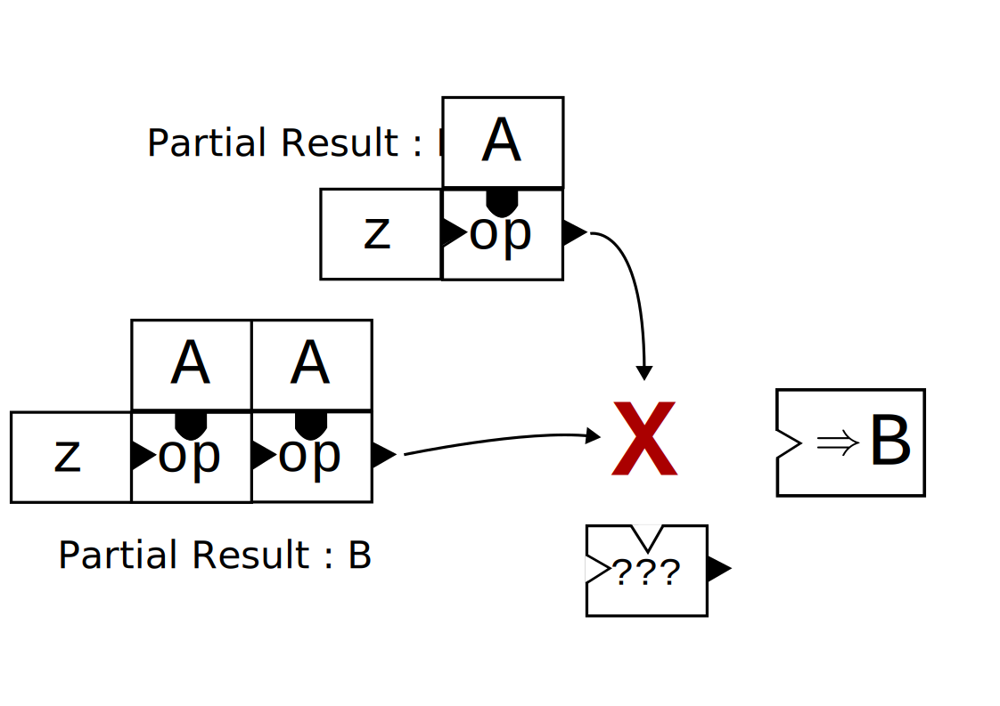

# Programming 2 - Exercise 9: Parallel Functional Programming

Welcome to this exercise, in which you will learn about parallel functional programming!

Exercises marked with ⭐️ are the most important ones. Exercises marked with 🔥 are the most challenging ones. You do not need to complete all exercises to succeed in this class, and you do not need to do all exercises in the order they are written.

## Parallel Aggregation

In the world of functional programming, methods like foldLeft serve as foundational building blocks to crunch large datasets or work with complex structures, as they encapsulate very generic operations on collections.

At its core, the fold operation takes a collection and recursively combines its elements using a function, starting with an initial accumulator value. It’s akin to folding a long piece of paper into smaller sections, step-by-step.

However, fold’s power doesn’t come without some limitations. The operation is inherently sequential. Each step relies on the outcome of the previous step. In our paper analogy, imagine trying to fold the next section of the paper before the previous fold has been completed.

### Siblings: reduce and fold ⭐️

For a minute, take a look instead at the `reduce` operation

```Scala
def reduce(op: (A, A) => A): A
```

which is quite close to fold itself. It repeatedly combines elements of the collection till there is a single element left. Implement `reduce` in terms of `foldLeft` or `foldRight` on `List[A]` by completing the skeleton in `FoldReduce.scala`:

```Scala
extension [A](l: List[A])
  def reduceWithFold(op: (A, A) => A): A =
    ???
```

<details>
<summary>Solution</summary>

```Scala
extension [A](l: List[A])
  def reduceWithFold(op: (A, A) => A): A =
    if l.isEmpty then throw Exception("reduce called on empty list")
    else l.tail.foldLeft(l.head)(op)
```
</details>

With an idea of how to implement `reduce` with `foldLeft` (as an example, `foldRight` is similar), let’s try to reverse-engineer why we were able to do this. This may seem like a strange thing to ask, but let’s begin with the signature of `foldLeft`:

```Scala
abstract class List[+A]:
  def foldLeft[B](z: B)(op: (B, A) => B): B
```

On the other hand, look at the instantiated signature that actually appears when implementing `reduce` (not quite correct to write, just for demonstration):

```Scala
// restricted case:
  def foldLeft(z: A)(op: (A, A) => A): A
```

Thus, we had to restrict foldLeft to the special case where the operator `op` acts only on `A`, i.e. `B` is `A`. In doing so, we lost much of the general power of foldLeft, where `B` and `op` were unconstrained.

With `reduce`, however, it is possible to have a parallel implementation! Are there any conditions we must impose on `op` or the input list `l` for this parallelization to be safe, i.e., deterministic?

> [!TIP]
> <details>
> <summary>Hint</summary>
> 
> In the operation `List(1, 2, 3).par.reduce(_ - _)`, there are two possible evaluations:
> ```Scala
> Option 1:
> 1 - (2 - 3) === 2
> 
> Option 2:
> (1 - 2) - 3 === -4
> ```
>
> but with `List(1, 2, 3).par.reduce(_ * _)`:
> ```Scala
> Option 1:
> 1 + (2 + 3) === 6
> 
> Option 2:
> (1 + 2) + 3 === 6
> ```
> </details>
> 
> <details>
> <summary>Solution</summary>
> 
> The operator `op` must be associative, as running in parallel, elements may be combined in any order.
> </details>

Implement a parallel version of `reduce` based on this idea (do not worry about complexity, for now):

```Scala
extension [A](l: List[A])
  def reducePar(op: (A, A) => A): A =
    ???
```

<details>
<summary>Solution</summary>

There are several very different ways to write parallel `reduce`, this is just one:

```Scala
extension [A](l: List[A])
  def reducePar(op: (A, A) => A): A =
    l match
      case Nil         => throw Exception("reduce called on empty list")
      case head :: Nil => head
      case _ =>
        val (left, right) = l.splitAt(l.length / 2)
        val List(leftR, rightR) =
          List(left, right).par.map(_.reducePar(op)).toList
        op(leftR, rightR)
```

The syntax `val List(x, y) = ...` does pattern-matching in place! Another example in the REPL:
```Scala
scala> val List(x, y) = List(1, 2).map(x => 2 * x)
val x: Int = 2
val y: Int = 4
```
</details>

With this, we have three conditions that allowed us to first define `reduce` in terms of `foldLeft`, and then parallelize it:

1. restriction of output type `B == A`
2. restriction of operator type `op: (B, B) => B`
3. restriction of operator behaviour `associative op`

Discuss these conditions in a group. Are they necessary? What do they change from the sequential constraints in `foldLeft`?


### What was fold again? ⭐️

This jumble with types and restrictions makes a case to go back to the signature of `foldLeft`, and take a closer look at what it does.

```Scala
abstract class List[+A]:
  def foldLeft[B](z: B)(op: (B, A) => B): B
```

which we can represent as a more intuitive “brick diagram”:


Here, elements of type `A` are shown as blocks with a rounded protrusion, which fits into rounded holes, accepting values of type `A`, while those of type `B` are shown with a sharp triangle. Applying a function corresponds to “inserting” its inputs, and getting the correct output type on the other side of the block.

> **Check yourself!**
> In this picture, what does the function `(x, y) => op(op(z, x), y)` look like?
> <details>
> <summary>Solution</summary>
>
> 
> </details>

So, in this interpretation, let’s look at what a partial/parallel result of `foldLeft` might look like:



On the left we have a `foldLeft` result on a list of two elements, and on the top, a result with one element. However, now we have two triangles, and no magic `???` that accepts two triangles and produces a triangle, which our output expects.

This suggests that what we’re missing in being able to parallelize `foldLeft` is then a way to *combine partial results*, each of type `B`.

### Aggregating what we’ve learnt ⭐️

Adding the missing combination operator to `foldLeft` gives us a function called `aggregate`:

```Scala
abstract class List[+A]:
  def aggregate[B](z: => B)(seqop: (B, A) => B, combop: (B, B) => B): B
```

Given all the missing pieces, combine them to implement parallel `aggregate` using `map` and `reduce` by completing this skeleton:

```Scala
extension [A](l: List[A])
  def aggregate[B](z: B)(seqop: (B, A) => B, combop: (B, B) => B): B =
    ???
```

### Many ways to aggregate ⭐️

There are many “correct” ways to implement `aggregate`, since we have not specified its function well enough yet. These implementations may differ from each other in subtle ways. Look at the following candidate implementations for `aggregate`:

<details>
<summary>Reveal implementations</summary>

```Scala
extension [A](l: Seq[A])
  def aggregate1[B](z: B)(f: (B, A) => B, g: (B, B) => B): B =
    l.par
      .map(f(z, _))
      .reduce(g)

  def aggregate2[B](z: B)(f: (B, A) => B, g: (B, B) => B): B =
    l.foldLeft(z)(f)

  def aggregate3[B](z: B)(f: (B, A) => B, g: (B, B) => B): B =
    if l.length <= 1 then l.foldLeft(z)(f)
    else
      l.grouped(l.length / 2)
        .toSeq
        .par
        .map(s => s.aggregate3(z)(f, g))
        .reduce(g)

  def aggregate4[B](z: B)(f: (B, A) => B, g: (B, B) => B): B =
    if l.length <= 1 then l.foldLeft(z)(f)
    else
      l.grouped(l.length / 2)
        .toSeq
        .par
        .map(s => s.aggregate4(z)(f, g))
        .foldLeft(z)(g)
```
</details>

Are all these implementations “correct”? Can you find cases where they fail to agree with your intuition of what `aggregate` should do?

Similar to the associativity of `op` that you discovered as a condition for safely parallelizing `reduce`, can you use your test cases to narrow down a condition that ensures `aggregate` behaves the same as the sequential `foldLeft`?

<details>
<summary>Hint</summary>

Running `aggregate` on a small example, consider two different types of parallel splits, and consider under what situations they would necessarily be equal.

Your condition should involve both `seqop` and `combop`.
</details>

<details>
<summary>Solution</summary>

$$
A: \forall t_1, t_2, s. combop(t_1, seqop(t_2, s)) = seqop(combop(t_1, t_2), s) \\
I: \forall t. g(z,t)=g(t,z)=t
$$

Intuitively, the condition A (“associativity”) says: you can fold over $a$ starting with $t_2$, and then combine it with the partial result $t_1$, or equivalently, combine $t_1$ and $t_2$ first, and then fold over $s$ with the resulting base element.

And secondly, I (“identity”) says that $z$ is the identity over $combop$.
</details>

### What’s special about this? 🔥

Taking a `List(a, b, c, d)` and inputs` f`, `g`, and `z` for `seqop`, `combop`, and `z` respectively, attempt to write down a few possible ways `aggregate` can be computed over it. As an example:

```Scala
g(f(f(z, a), b), f(f(z, c), d)) 
```

Now, exhaustively simplify this expression based on the rules you derived above to this expression. What do you obtain?

<details>
<summary>Solution</summary>

```Scala
0. g(f(f(z, a), b), f(f(z, c), d))      Original Expression
1. f(g(f(f(z, a), b), f(z, c)), d)      Apply A t_1 = f(f(z, a), b), t_2 = f(z, c), s = d
2. f(f(g(f(f(z, a), b), z), c), d)      Apply A t_1 = f(f(z, a), b), t_2 = z, s = c
3. f(f(f(f(z, a), b), c), d)            Apply I t = f(f(z, a), b)
```
The final expression obtained is precisely the sequential application pattern of `foldLeft`.
</details>

### Analyzing the implementations 🔥

Can you come up with minimal mathematical conditions on `seqop`, `combop`, and `z` such that the implementations above will produce different results? In which cases are the functions the same on *all* inputs?

<details>
<summary>Hint</summary>

Try to identify which different operations the implementations use, and what the safety conditions of those smaller operations are.

Writing the concrete output on a small symbolic list, e.g. `List(a, b, c)`, can go a long way in identifying general hypotheses to test.
</details>


## Parallel Parentheses Matching

> [!NOTE]
> You may need to do the aggregate exercise above first to understand the last subsection of this exercise.

Imagine for a moment that you’re building a modern architectural masterpiece. This building, unlike any other, is held together by a series of intricate and delicate balancing acts. Each element, be it a beam, a plank, or a brick, needs another corresponding element to keep it balanced. If even one piece is out of place, the entire structure could collapse.

In mathematical expressions and your code, this glorious task is performed by the humble parentheses `()`. What happens if one parenthesis is left unmatched? A mathematical expression becomes unsolvable, a sentence becomes confusing, and your code reports a hundred errors (*sigh*).

Let’s take a look at strings and identify these balancing acts.

### What is ‘balance’? ⭐️

We say a string is *balanced*, here, if every opening parenthesis `(` is matched to a unique `)` succeeding it in the string, and vice versa, no closing parenthesis `)` should be left alone.

> **Check yourself!**
> 
> Which of the following strings are balanced?
> 
> 1. `(o_()`
> 2. `(if (zero? x) max (/ 1 x))`
> 3. `:-)`
> 4. `())(`
> 5. `I told him (that it's not (yet) done). (But he wasn't listening)`
> 6. `(5 + 6))(7 + 8`
> 7. `((()())())`
> <details><summary>Reveal the answer</summary>
> 2, 5, and 7 are balanced, the others are not.
> </details>

### Not all strings are made the same ⭐️

Before we jump into actually writing code to solve our problem, it can be worthwhile to look at several examples to understand the structure of the problem first.

Consider the strings

1. `))()`
2. `((()`
3. `((())`

From the perspective of the balancing problem, are all of these strings the same? Or are there noticeable differentiating factors between 1 and 2, between 2 and 3? Assume that you can extend the strings on the right, but not on the left.

<details>
<summary>Solution</summary>
String 1 cannot be extended on the right to be balanced, it is in an unrecoverable state, and any extension of it will be unbalanced.

2 and 3 on the other hand, can both be extended to balanced strings. 3 is “closer” to being balanced, as it needs only one more closing parenthesis.

So, the number of open nested parentheses seems to be something we naturally look for. Can we make an implementation around this idea?

We can get the same analysis from right-to-left as well.
</details>

We have been trying to deal with all of our problems recursively till now. Based on your observation, can you come up with a recursive pattern on strings to check for balancing? What properties or quantities does your recursion rely on?

Use these ideas to write a function that recurses on a string, represented as a list of characters, `List[Char]`, to check whether it is balanced:
```Scala
def isBalancedRecursive(str: List[Char]): Boolean =
  ???
```
You may use your own helper functions as you want inside `isBalancedRecursive`.

### Folding Up ⭐️

As we have seen again and again, most recursive functions we write are really standard functional operations in disguise. Rewrite your recursive function using a fold operation on str by completing the skeleton

```Scala
def isBalancedFold(str: List[Char]): Boolean =
  ???
```

### Parallelizing Folds ⭐️

As we now know of `aggregate` as the parallel version of a fold, this gives us an opportunity to take our balancing check and extending it to be parallel.

Can we use the number of open parentheses as before and simply apply `aggregate`?

```Scala
def isBalancedParSimple(str: List[Char]): Boolean =
  val foldingFunction: (Int, Char) => Int = ??? // your folding function

  val numOpen = str.par.aggregate(0)(foldingFunction, _ + _)

  (numOpen == 0)
```

The `aggregate` here applies fold as you did above, and combines the partial results by adding the resulting numOpen values. Does this always produce the correct balancing decision for any string?

<details>
<summary>Solution</summary>

No. Consider a simple string `)(`. In the sequential fold version, you would find that the string is in an unrecoverable state, and return `numOpen = -1`. However, here, since we are computing `numOpen` in parallel, the following can happen:

```Scala
          parallel thread 1   parallel thread 2
input            ")"                 "("
numOpen          -1                  +1
after reduce    (-1) + (+1) == 0
```
and since `== 0 `is our condition for balancing, we will claim that the string `)(` is balanced, which is incorrect according to our definition.
</details>

Design a new parallel implementation based on `aggregate` by filling in the skeleton below. Change occurrences of the type Any to the type you want to use as your result type.

```Scala
def isBalancedPar(str: List[Char]): Boolean =
  val seqOp: (Any, Char) => Any = ???
  val combOp: (Any, Any) => Any = ???

  str.par.aggregate(???)(seqOp, combOp) == ???
```

<details>
<summary>Hint</summary>

In `foldLeft` or `foldRight`, we know that we are moving the data in one chosen direction. So, we maintained a `numOpen` value, which represented the number of parentheses we needed to close while moving in this direction.

However, when we work in parallel and use reduce, the “reduction” happens simultaneously in both directions:

```Scala
        1      2   3
String   (((    )))  ()()
numOpen  +3     -3   0
```
`reduce` could first combine the results from 1 and 2, or from 2 and 3. Thus, String 2 can now be “extended” in either direction.

Thus, we can maintain two numOpen values, representing the number of open brackets to the left, and to the right.

For example, the string `)))()((` would have the result `opens = (3, 2)`. Your aggregating `combOp` now has to combine two tuples representing these values.
</details>


## Tabulation

Quite often, we find ourselves with collections whose elements are determined by a pattern. For example, a list of even numbers up to 6, `Array(0, 2, 4, 6)`, which is the function` x => 2 * x `evaluated from indices `0` to `3`. To specialize the generation of such collections, the Scala library provides the simple function `Array.tabulate` (similarly `List.tabulate`, etc). The function provides the [following interface](https://scala-lang.org/api/3.x/scala/Array$.html#tabulate-fffffde9):

```Scala
  /** Returns an array containing values of a given function over a range of integer
   *  values starting from 0.
   *
   *  @param  n   The number of elements in the array
   *  @param  f   The function computing element values
   *  @return An `Array` consisting of elements `f(0),f(1), ..., f(n - 1)`
   */
  def tabulate[T: ClassTag](n: Int)(f: Int => T): Array[T]
```

It accepts a generating function, and the size of the new array. The `ClassTag` is required by an `Array` due to interactions with Java library code. You can optionally read a discussion about it [here](https://users.scala-lang.org/t/classtag-for-parametrized-array/3894).

So, great! `tabulate` exists. Let’s take a quick look at the parallel version, [`ParArray.tabulate`](https://www.scala-lang.org/api/2.12.2/scala/collection/parallel/mutable/ParArray$.html#tabulate[A](n:Int)(f:Int=%3EA):CC[A]), whose source code can be found [here](https://github.com/scala/scala-parallel-collections/blob/adab76ded75364c1718c4543fe71f5d1b3ae60dd/core/src/main/scala/scala/collection/generic/ParFactory.scala#L112):

```Scala
 /** Produces a $coll containing values of a given function over a range of integer values starting from 0.
   *  @param  n   The number of elements in the $coll
   *  @param  f   The function computing element values
   *  @return A $coll consisting of elements `f(0), ..., f(n -1)`
   */
  def tabulate[A](n: Int)(f: Int => A): CC[A] = {
    val b = newBuilder[A]
    b.sizeHint(n)
    var i = 0
    while (i < n) {
      b += f(i)
      i += 1
    }
    b.result()
  }
```

Don’t be intimidated by it! We don’t have much to do with it, except noticing... it does nothing in parallel. *But my parallelization!*

Too bad. Well, we have to write it ourselves 😊

### Tabulating Sequentially 🧪

From scratch, or using the library implementation as a hint, try to write a sequential `Array.tabulate` with data structures and operations familiar to you:

```Scala
extension (a: Array.type)
  def seqTabulate[A: ClassTag](n: Int)(f: Int => A): Array[A] =
    ???
```

The extension on `Array.type` is there so you can follow this up by using your new function as `Array.seqTabulate(n)(f)` just like the Scala library!

### Parallelizing 🧪

Finally, parallelize your tabulation! This may be quite easy if you wrote it completely functionally, or a bit more work if you did it imperatively like the library. But that extra work comes with its own benefit. See the next section for a comparison of performance.

```Scala
extension (p: ParArray.type) {
  def parTabulate[A: ClassTag](n: Int)(f: Int => A): ParArray[A] =
    ???
}
```

### Zipping Through

With your functional `parTabulate` ready to go, implement a function `zipWith`, which takes two arrays, and computes a new array by zipping them and applying a function to them.

As an example, consider vector addition:

```Scala
def vectorAdd(a: Array[Int], b: Array[Int]) =
  a.zipWith((l: Int, r: Int) => l + r)(b)
```

```Scala
val a = Array(1, 2, 3)
val b = Array(4, 5, 6)
vectorAdd(a, b) // == Array(5, 7, 9)
```

Complete the following skeleton:

```Scala
extension [A](seq: Array[A])
  def zipWith[B, C: ClassTag](f: (A, B) => C)(other: Array[B]): Array[C] =
    ???
``` 

### Many Paths Down the Optimization Abyss 🔥

Given the following three implementations of `parTabulate`:

<details><summary>Reveal implementation</summary>

```Scala
extension (p: ParArray.type)
  def parTabulateArrayMap[A: ClassTag](n: Int)(f: Int => A): ParArray[A] =
    (0 until n).toArray.par.map(f)

  def parTabulateBinarySplit[A: ClassTag](n: Int)(f: Int => A): ParArray[A] =
    val destination = new Array[A](n)
    tabulateToArray(destination, f, 0, n)
    destination.par

  def parTabulateMapReduce[A: ClassTag](n: Int)(f: Int => A): ParArray[A] =
    // does not take advantage of the fact that we know the output is an Array of the same size
    // we may want to use this if the output type was arbitrary instead
    (0 until n).par.map(i => Array(f(i))).reduce(_ ++ _).par

def tabulateToArray[A: ClassTag](
    destination: Array[A],
    f: Int => A,
    from: Int,
    to: Int
): Unit =
  val lim = 500
  if to - from < lim then
    // just run sequentially
    (from until to).foreach(i => destination(i) = f(i))
  else
    // fork
    Vector(
      from -> (from + to) / 2,
      (from + to) / 2 -> to
    ).par.map((from, to) => tabulateToArray(destination, f, from, to))
```
</details>

and the following performance results:

<details><summary>Reveal test results</summary>

```Scala
[info] Benchmark                           Mode  Cnt      Score      Error  Units
[info] TabulateBench.arrayMapTabulate     thrpt    5  14807.612 ± 1046.269  ops/s
[info] TabulateBench.binarySplitTabulate  thrpt    5  19795.445 ± 1923.883  ops/s
[info] TabulateBench.mapReduceTabulate    thrpt    5   1173.758 ±   93.304  ops/s
```

where `ops/s` stands for operations per second, higher is better. `Cnt` stands for count, the number of times the benchmarks were repeated, and `Mode` is the chosen way of measuring the performance (throughput).

The tests were run with an array size of 10,000 and the tabulation function as `f: Int => Int = x => 2 * x`.

The benchmarking was done with the [Java Microbenchmark Harness (jmh)](https://github.com/openjdk/jmh).
</details>

Discuss the different implementations in groups and with the TAs to come up with possible hypotheses to explain their performance differences. Run the different versions yourself with different examples to test your hypotheses.

You can also run the JMH benchmarks yourself inside `sbt` with the following command:

```Scala
Jmh/run -t max -f 1
```

where `-t max` tells JMH to use the maximum number of threads available, and `-f 1` tells it to use one fork, i.e., run the whole benchmark suite only once. Feel free to play with the values. You can also use `Jmh/run -h` to see all available options.

### Takeaways

There are many ways to write code that performs a given task, and performance numbers are never straightforward to guess without intricate knowledge of the system. Especially when working with parallel code, it is imperative to test your code and its performance extensively, and to write the code that fits your task and situation best.

Building functional interfaces on top of performant code lets you abstract away the complexity and the pains of optimization from your users as well as the future you who may use these interfaces to build much larger systems, where repeating complex solutions would be highly undesirable.

It is *imperative* to test your code, but it is essential to make it *functional*!