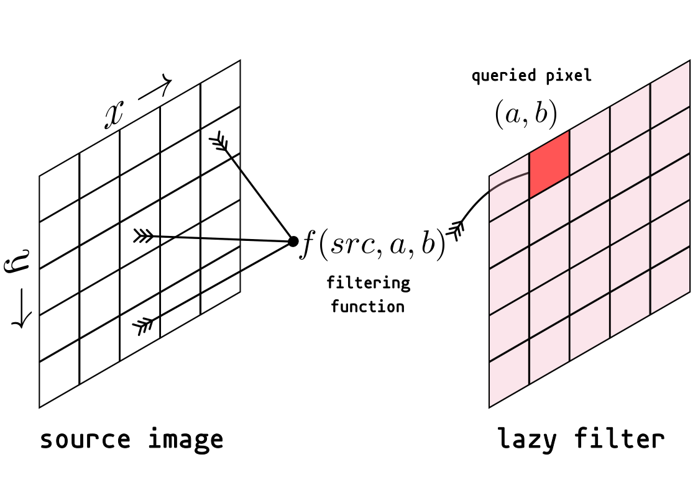

# Programming 2 - Exercise 9: Scalashop

Today, we will try our hand at image processing! Particularly, we will design an interface to apply a variety of simple filters to an image. We will take a look at ways to encapsulate code behind simple, functional interfaces, and the subsequent simplicity we gain when parallelizing our implementation to adapt to scale.

## Logistics

You will work on the following files:

* [src/main/scala/scalashop/image/Filter.scala](src/main/scala/scalashop/image/Filter.scala)
* [src/main/scala/scalashop/image/ParImage.scala](src/main/scala/scalashop/image/ParImage.scala)

If you have issues with your setup (Scala installation, IDE, using the terminal, etc.), please call us.

__As always, your are allowed to copy/clone/fork this repository, but not to share solutions of the exercise in any public repository or web page.__

## Colors and Pixels

To begin processing images, we have to understand how images are built and represented. The structures and utilities for this have already been implemented in the package `scalashop`.

Images are represented as rectangular arrays of pixels, with each pixel made up of 4 parts: alpha, the opacity of the pixel, and the three color components, red, green and blue. We choose to use 8 bits (0 - 255) for each of the components, so that a pixel’s data fits inside a single integer (32 bits). We have

```Scala
/** The value of every pixel is represented as a 32 bit integer. */
type ARGB = Int
```

giving us the following representation of a pixel, in binary and in hexadecimal:


With this structure, we can retrieve any component by filtering and shifting bits in the pixel data:

```Scala
/** Returns the alpha component. */
def alpha(c: ARGB): Int = (0xff000000 & c) >>> 24

/** Returns the red component. */
def red(c: ARGB): Int = (0x00ff0000 & c) >>> 16

/** Returns the green component. */
def green(c: ARGB): Int = (0x0000ff00 & c) >>> 8

/** Returns the blue component. */
def blue(c: ARGB): Int = (0x000000ff & c) >>> 0
``` 

Finally, we can construct an `ARGB` value from the individual components by taking the lowest 8 bits of each and combining them

```Scala
/** Used to create an ARGB value from separate components. */
def argb(a: Int, r: Int, g: Int, b: Int): ARGB =
  (a << 24) | ((r << 24) >>> 8) | ((g << 24) >>> 16) | ((b << 24) >>> 24)
``` 

> **Check yourself!**
> 
> What are the ARGB values for a pure red pixel?
> 
>  <details>
> <summary> Reveal the answer </summary>
> 
> A = 255 (100% opacity), R = 255, G = 0, B = 0.
> </details><br/>

## Matrices and Images

The trait `Matrix` is the essence of what will soon become an `Image`. It is a structure that has a `height`, a `width`, and allows you to access its elements with a coordinate pair `(x, y)`.

```Scala
trait Matrix[A]:
  val height: Int
  val width: Int

  /** Access matrix elements
    */
  def apply(x: Int, y: Int): A
``` 

This trait is parametrized over the parameter `A`, i.e, it represents a matrix of any type `A`. An image is, in particular, a matrix of pixels. So we define an `Image` as

```Scala
/** Given two coordinates, provides a Pixel. Builds sequentially by default.
  *
  * @param height
  *   height of the image
  * @param width
  *   width of the image
  */
trait Image(val height: Int, val width: Int) extends Matrix[Pixel]:
```

where `Pixel` is just another alias for `ARGB`, but is a more readable name in context
```Scala
/** Readable alias for underlying pixel representation
  */
type Pixel = ARGB
```

As a base case for this trait, we would like to be able to load existing images and store their data. This is done with an `ArrayImage`, which stores the image data in an `Array[Pixel]` and returns this data when queried:

```Scala
/** Fully built image with a concrete underlying Array storing pixel data.
  */
final class ArrayImage(
    height: Int,
    width: Int,
    private val data: Array[Pixel]
) extends Image(height, width):

  /** Access underlying image data
    */
  def apply(x: Int, y: Int) = data(x + y * width)

  /** Update underlying image data, mutating state
    */
  def update(x: Int, y: Int, elem: Pixel) = data(x + y * width) = elem
```

## Filters

A filter is any object that takes an image, and produces a new one, possibly manipulating it in the middle. Complying with our `Image` interface, a filter is implemented by defining an apply method:

```Scala
/** Identity filter, does not change pixels of the source image.
  */
class Identity(src: Image) extends Image(src.height, src.width):
  def apply(x: Int, y: Int): Pixel =
    src(x, y)
```

We have here the `Identity` filter, which, for any pixel at coordinates $(x,y)$, simply returns the underlying pixel of the source image. However, we can do so much more!

In general, a filter is a view over the image, that computes the required pixels on demand:



### Black and White Filter

In the file `Filter.scala`, find the skeleton for the filter `BlackAndWhite`.

```Scala
/** Black and white filter, transforms the source image in a grayscale one.
  */
class BlackAndWhite(src: Image) extends Image(src.height, src.width):
  // we generate a weighted grayscale image
  // to do this, we compute the "Luma" of each pixel
  // these numbers come from a standard called Rec 601
  // and are computed based on how we perceive colour and brightness
  // see: https://en.wikipedia.org/wiki/Luma_(video)
  val lumaR = 0.299f
  val lumaG = 0.587f
  val lumaB = 0.114f
  def grayscale(input: Pixel) =
    ???

  def apply(x: Int, y: Int): Pixel = grayscale(src(x, y))
```

Taking a look at the provided `apply` method, the filter is expected to take the source pixel, and apply a `grayscale` function to it. The grayscale value of a pixel is computed based on the $luma$ for each color.

We use the [Rec 601 standard](https://en.wikipedia.org/wiki/Luma_(video)#Rec._601_luma_versus_Rec._709_luma_coefficients), which provides three constants, the luma modifiers for red, green, and blue. The luma of the entire pixel is computed by multiplying these constants with the RGB values of the pixel, keeping the alpha the same.

This is shown by the following relationship:

$$ (a,r,g,b) \mapsto(a,luma,luma,luma) ~\text{where}~ luma=lumaR \times r + lumaG \times g+lumaB \times b $$

and as a concrete example:


Complete the `grayscale` function to implement this transformation.

You can test this filter by running `testOnly -- "*blackAndWhite:*"` in `sbt`.

### Color “Splash” Filter

While a black and white filter is interesting by itself, we can do more things with it as a base too. Implement a selective black and white filter, that leaves bright red pixels. You’ll see a result like this:


Do this by completing the `apply` method in the RedSplash filter:

```Scala
class RedSplash(src: Image) extends BlackAndWhite(src):
  def isRedEnough(px: Pixel) =
    val r = red(px).toFloat
    val g = green(px).toFloat
    val b = blue(px).toFloat
    (r / g > 1.7) && (r / b > 1.7)

  override def apply(x: Int, y: Int): Pixel =
    ???
```

The `apply` method of the filter allows you to specify the image by deciding how to compute *a single pixel* from the source.

You can try it on the image above stored in the lab files at [src/main/resources/scalashop/citrus.jpg](src/main/resources/scalashop/citrus.jpg).

The functional `apply(x, y)` interface allows us to easily extend filters in any way we desire to obtain other interesting effects on images. You can just as well try to make green, blue, or other interesting filters.

You can test this filter by running `testOnly -- "*redSplash:*"` in `sbt`.

### Trying your Filters

Having completed two filters, we can go try them out! Scalashop comes with a GUI where you can try filters on your favourite images. You can start the GUI with

```Scala
sbt run
```

By default, it opens the image stored at [src/main/resources/scalashop/citrus.jpg](src/main/resources/scalashop/citrus.jpg), but you can import your own images by navigating to `File -> Open...`.


You can select which filter to apply with the `Filter` drop-down.

>[!WARNING]
> Before you begin the parallelization section, changing the “number of tasks” in the Scalashop GUI will result in an exception, so leave it at the default, 1, while you work. Any filters you have not implemented yet will also result in errors, which you can see in your terminal, and the image will be left unaltered.

### Testing without a GUI

It can be inconvenient to look at an image with a million pixels to debug your code, so we also provide a simple interface for you to look at your images as raw numeric data on the console. You can refer to [src/main/scala/scalashop/Test.scala](src/main/scala/scalashop/Test.scala). You’ll find some instances of using the `.show` method on images, alongside some ways to construct your own images as test cases, for example a diagonal line:

```Scala
/** Diagonal black line B W W W W W B W W W W W B W W W W W B W W W W W B
  *
  * The image is created via a direct specification of the apply method to
  * avoid writing the whole array
  */
val diagonalImage = new Image(5, 5):
  def apply(x: Int, y: Int): Pixel = if x == y then black else white
```

Up next, we’d like to do a more complicated filter, a blur.

### Blur

Let us start by trying to construct a method to blur an image from a small example, a black pixel (`0xff000000`) surrounded by white ones (`0xffffffff`):


We would like to take this sharp black pixel and have it affect its surroundings, and vice versa. The simplest way to do this is to take the average of its neighbours, which results in the following matrix


While this method may seem naive, it can produce surprisingly nice blurs on larger images (intentionally low resolution to show blurring):


Performing the blur using a mean over neighbours is called a *box-blur*. The distance to neighbours we choose to consider is the radius of this blur.

Implement a box-blur by completing the `SimpleBlur` class in `Filter.scala`:

```Scala
/** Performs a simple box-blur of given radius by averaging over a pixel's
  * neighbours
  *
  * @param src
  *   source image
  */
class SimpleBlur(src: Image) extends Image(src.height, src.width):
  val radius: Int = 3

  def apply(x: Int, y: Int): Pixel =
    ???
``` 

The blur should have radius 
3
3, i.e., it should average over neighbours in the range $[x−3,x+3]×[y−3,y+3]$.

However, what happens at a corner? We may not have the same number of pixels to perform an average over! In this case, you would have to count for the number of neighbours in the radius, and compute the average accordingly. Consider this example for a blur of radius $1$, where there are only $3$ neighbours and the center itself available at a corner:


You can test this filter by running `testOnly -- "*simpleBlur:*"` in `sbt`.

### Gaussian Blur

While the simple blur produces a convincing effect, there may be other ways to average over the values of your neighbours. For example, we may want to assign more weights to adjacent pixels, as pixels diagonal to the center are “farther away”:


This is called a *Gaussian* blur, as the assignment of weights looks like a Gaussian distribution according to the distance from the center:


A Gaussian blur tends to result in a softer blurring effect:


There are several other combinations we could try within this general setup for blurring, and it seems worthwhile to generalize this idea of weighted means. Here, the set of weights forms a blurring *kernel*.

$$Kernel_{Gaussian 3×3} = 
\begin{bmatrix}
1 & 2 & 1\\
2 & 4 & 2 \\
1 & 2 & 1
\end{bmatrix}$$
  
​
and in the case of the box-blur

$$Kernel_{box 3×3} = 
\begin{bmatrix}
1 & 1 & 1\\
1 & 1 & 1 \\
1 & 1 & 1
\end{bmatrix}$$

And the operation of applying the kernel to an image is called a convolution. [You can find more information about this here: Kernel (image processing) on Wikipedia](https://en.wikipedia.org/wiki/Kernel_(image_processing)).

Extrapolating from the examples above, we can make a general function for applying a kernel to an image:
$$
\begin{align*}
convolution(x,y) =~& kernel∗image(x,y) \\
​                 =~& \sum_{dx=-a}^{a}\sum_{dy=-b}^{b} kernel(dx, dy) \times image(x - dx, y - dy)
\end{align*}
$$

where the size of the kernel is $2a+1×2b+1$. This places an emphasis on the point $(a,b)=(0,0)$, which is the center point of our convolution, and is a natural way to intuitively think about convolutions. Alternatively, for computation, in $(0,0) → (kernel.width,kernel.height)$ coordinates:

$$
\begin{align*}
convolution(x,y) =~& kernel∗image(x,y) \\
​                 =~& \sum_{dx=0}^{width-1}\sum_{dy=0}^{height-1} kernel(dx, dy) \times image(x + dx - \frac{width}{2}, y + dy - \frac{height}{2})
\end{align*}
$$

To keep things simpler, you can assume that $image(x,y)$ for $(x,y) \not\in [0,width)×[0,height)$ is $0$, and so indices outside the image domain have no contribution. You do not have to check for special cases in the corner like in the case of `SimpleBlur`.

> > **Check yourself!**
> What happens when we don’t account for the special case of the corners?
> 
> You can find out the result by taking an image in the GUI, and running a box-blur of sizable radius (5 or 7) a few times, and see if you notice something weird around the edges 🤔.

Now, we will implement the convolution in the filter `Convolution` and its `apply` method:

```Scala
/** Produce the convolution of an image with a kernel
  *
  * @param src
  *   source image
  * @param kernel
  *   kernel to convolve with
  */
class Convolution(src: Image, kernel: Kernel) extends Image(src.height, src.width):
  def apply(x: Int, y: Int): Pixel =
    ???
``` 

Same as an `Image`, a `Kernel` is also a `Matrix`, but of `Float` values.

The `GaussianBlur`, `BoxBlur`, and a `Blur` with an arbitrary kernel have been implemented in terms of `Convolution` already in `Filter.scala`. You’re ready to go try them all out!

As a fascinating example of the use of convolutions, you can check out the `SobelEdgeDetection` filter:

```Scala
/** Sobel edge detection filter, used to detect the horizontal and vertical
  * edges of an image. Take a look at `Kernel.sobelX` and `Kernel.sobelY` for
  * default kernels for this filter.
  */
class SobelEdgeDetection(src: Image, kernelX: Kernel, kernelY: Kernel)
    extends Image(src.height, src.width):
```

You can test your convolution implementation by running `testOnly -- "*convolution:*"` in `sbt`.

## Embarrassingly Parallel Problems

Taking a look at the filters again, we find that they’re performing a lot of calculations. The default image [src/main/resources/scalashop/citrus.jpg](./src/main/resources/scalashop/scala.jpg) has a resolution of 1500 x 843; that’s 1.26 million pixels to compute, and they’re all independent of each other! This is a perfect opportunity to test out our knowledge of parallelizing tasks.

To achieve this, we take a look at how images are computed from filters to be displayed. This is done inside the `build` function provided by the `Image` trait:

```Scala
/** Builds this image into an `ArrayImage`, sequentially.
  */
def build: ArrayImage =
  val dst = new ArrayImage(height, width)

  for
    y <- 0 until height
    x <- 0 until width
  do dst(x, y) = this(x, y)

  dst
``` 

Here, we construct an `ArrayImage`, by computing pixel values and mutably writing to it. This lets us “queue” up filters lazily and collapse them into a flat array that can be accessed quickly for display and further computation. While the filters provide a clean functional interface, we can encapsulate and “hide away” our complications and mutable code for the sake of efficiency.

Instead of attempting to parallelize the filters and changing the entire interface, we can wrap them up and simply alter the `build` process that computes the final image. This is simplicity gained by having an interface that is functional and lazy, so we could decide how we carry out the computation at a single top-level stage.

To parallelize the construction, we create a class `ParImage`, which inherits the properties of an `Image`, but implements a new `build` function to be parallel. Complete the provided skeleton for `ParImage.build`.

```Scala
override def build: ArrayImage =
  // compute the collection to work on
  val splits: Seq[Int] = ??? // type is provided just so it compiles, feel free to change it
  val parSplits = splits.par

  parSplits.tasksupport = ForkJoinTaskSupport(
    ForkJoinPool(parallelization)
  ) // make sure we apply the desired level of parallelism

  val destination = ArrayImage(height, width)

  // perform your computation in parallel
  ???
  // return the constructed image
  destination
````

You are provided with a `buildSequential` function, which does the same work as `Image.build`, but on a small section of the image.

```Scala
private def buildSequential(
    destination: ArrayImage,
    xFrom: Int,
    xTo: Int,
    yFrom: Int,
    yTo: Int
): Unit =
  ???
``` 

However, here, we care about how many parallel tasks we spawn, they’re provided by the user through the GUI, so be careful about that in your implementation! You can control this either by using the provided `tasksupport` skeleton, or by removing it and writing your own `task {}` based code.

You can test your parallel implementation by running `testOnly -- "*parallel:*"` in `sbt`.

## Experimentation and Understanding Measurements

With a completed and parallelized system for image processing, Scalashop will take over the world as the leading choice for image editing! Feel free to play with the number of tasks available to the system and observe how the time required to apply a filter changes with it.

* How many processors does your system have? How does the performance change as you increase the number of tasks up to this number, or beyond?
*  How does performance change when you parallelize a smaller task, like the black and white filter?
* Can you compare the performance for your `SimpleBlur` with the `BoxBlur` based on `Convolution`? Are there any differences? If yes, try to discuss the possible reasons.

There are a lot of dials to tweak when working with parallel systems, and not all of them lead to the same results in every scenario! Some tasks can be small enough to make parallel code slower due to the added overhead of threads, while some can scale almost linearly with available resources.

It’s the programmer’s job to decide whether to parallelize their system, at what level the parallelization must be introduced, and with what granularity. Concurrent and asynchronous systems often help utilize the resources at hand much more efficiently, but are highly prone to both bugs and optimization-traps, where something clearly looks like it should help, but in fact degrades performance.

In any case, however, good interfaces and abstractions play a central role in design and development of software. They greatly affect the options you have available in the future, be it for parallelization or otherwise.

It can be great fun to think of how you would write `scalashop` from scratch, and how you might optimize it further!


## Photo credit

All pictures used were obtained from Unsplash — [Bruna Branco (Citrus)](https://unsplash.com/photos/flat-lay-photography-of-sliced-pomegranate-lime-and-lemon-7r1HxvVC7AY) and [Tom Brunberg (Fruits and Vegetables)](https://unsplash.com/photos/vegetables-and-fruits-display-D4ZtZX1UeAI) — and are licensed for free use under the [Unsplash license](https://unsplash.com/license).
